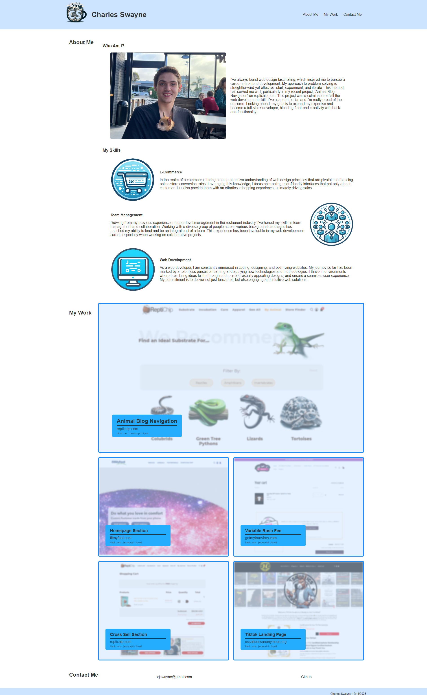

# cjswayne-portfolio

## Description 
In this project I created my own professional portfolio to showcase the various projects I've worked on. I started with a basic structure of the html, then added in content and sourced/created the images/icons. From there I styled the portfolio to meet basic webpage standards.

## Repository

Link to deployed code: [https://cjswayne.github.io/cjswayne-portfolio/](https://cjswayne.github.io/cjswayne-portfolio/)

## Technologies 
 - This written using HTML5 and CSS
 - HTML follows semantic structure for SEO 
 - All img tags have alt descriptions for accessibility

## Mockup

## Credits
I took Inspirition from [https://www.ybrikman.com/](https://www.ybrikman.com/), and
[JD Tadlock](https://github.com/jdtdesigns)

## License 
This project is under the MIT license.